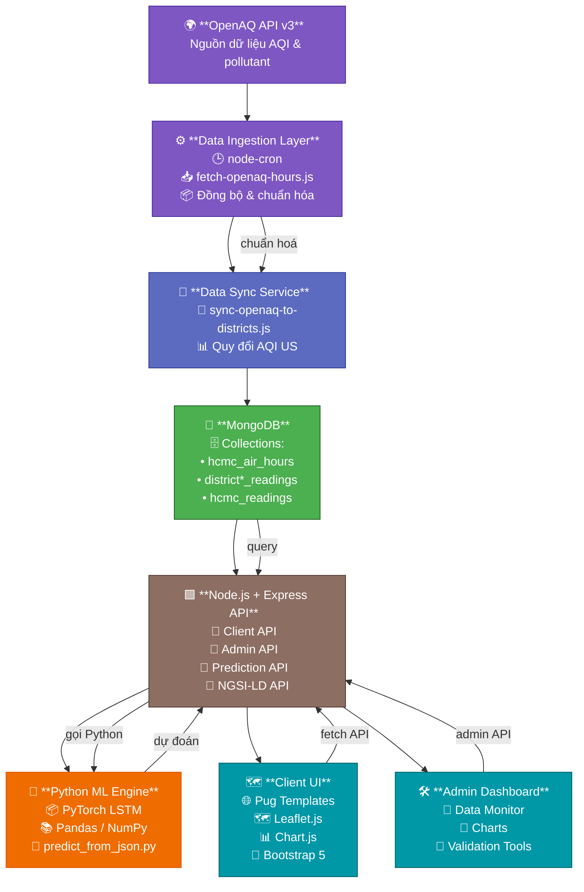

# 🌿 Eco-Track — Open Air Quality Intelligence Platform for Ho Chi Minh City

### Một dự án môi trường thông minh – dữ liệu mở – mã nguồn mở của **SIU-Sirocco-2025**

Eco-Track là nền tảng thu thập, chuẩn hóa, phân tích và dự đoán chất lượng không khí (AQI) theo thời gian thực cho TP.HCM.
Dự án được xây dựng theo tiêu chuẩn **dữ liệu mở đô thị thông minh (Open Urban Data)**, tương thích:

* **NGSI-LD** (ETSI ISG CIM)
* **SOSA/SSN Ontology** (W3C)
* **FiWARE Smart Data Models**
* **Linked Open Data (LOD)**

Eco-Track được xây dựng như một giải pháp hoàn chỉnh để tham dự cuộc thi Olympic Phần mềm Mã nguồn mở – OLP 2025, tập trung vào lĩnh vực dữ liệu đô thị mở về môi trường, đặc biệt là chất lượng không khí (AQI), theo đúng tiêu chuẩn NGSI-LD, SOSA/SSN và FiWARE Smart Data Models yêu cầu trong đề thi.

  

---

# 🌏 Sứ Mạng – Tầm Nhìn – Giá Trị Cốt Lõi

## 🎯 **Sứ mạng (Mission)**

Xây dựng nền tảng dữ liệu mở về môi trường giúp:

* Cộng đồng theo dõi chất lượng không khí theo thời gian thực
* Nhà quản lý nắm bắt xu hướng ô nhiễm để ra quyết định
* Sinh viên – nhà nghiên cứu truy cập dữ liệu mở phục vụ học thuật
* Thúc đẩy văn hóa **phát triển mã nguồn mở**, chia sẻ dữ liệu mở

## 🚀 **Tầm nhìn (Vision)**

Trở thành nền tảng dữ liệu môi trường mở chuẩn hóa theo NGSI-LD đầu tiên tại Việt Nam, có khả năng:

* Mở rộng đến nhiều thành phố
* Tích hợp cảm biến IoT thực tế
* Tương thích FIWARE, Smart City Ecosystem
* Kết nối vào hệ thống **đô thị thông minh quốc gia**
* Ứng dụng quan sát – dự đoán – cảnh báo môi trường

## ❤️ **Giá trị cốt lõi (Core Values)**

* **Minh bạch:** dữ liệu mở – mã nguồn mở
* **Cộng đồng:** mọi người đều có quyền truy cập thông tin môi trường
* **Bền vững:** hướng đến một đô thị khỏe mạnh
* **Chuẩn hóa:** tuân thủ NGSI-LD / SOSA-SSN / LOD
* **Học thuật:** phục vụ sinh viên, giảng viên, nhà nghiên cứu

---

# 🧩 Liên hệ với yêu cầu đề thi OLP 2025

Đề bài của OLP 2025 yêu cầu:

* Ứng dụng thành phố thông minh dựa trên **nền tảng dữ liệu mở đô thị**
* Mô hình hóa dữ liệu theo **SOSA/SSN – W3C**
* API mở theo **NGSI-LD – ETSI CIM**
* Tương thích **FiWARE Smart Data Models**
* Dữ liệu từ nguồn **OpenAQ, OpenWeatherMap, OSM, GTFS**
* Hướng đến cộng đồng & quản lý đô thị

👉 **Eco-Track đáp ứng hoàn toàn yêu cầu đề thi – được thiết kế theo đúng tiêu chuẩn đô thị thông minh.**
👉 Tập trung vào **dữ liệu chất lượng không khí (AQI)**

---

# ✨ Chức Năng Chính

* Thu thập AQI theo giờ từ OpenAQ
* Chuẩn hóa dữ liệu theo schema đô thị
* Dashboard trực quan (map, heatmap, charts)
* Dự đoán AQI 24 giờ bằng LSTM
* API mở: REST + NGSI-LD
* Context JSON-LD theo SOSA/SSN & FIWARE

---

# 🏗️ Kiến Trúc & Công Nghệ

## 🔧 Công nghệ chính

* **Backend:** Node.js + Express
* **Database:** MongoDB + Mongoose
* **Frontend:** Pug, Bootstrap 5, Leaflet.js, Chart.js
* **Scheduler:** node-cron
* **ML Engine:** Python (NumPy, Pandas, scikit-learn, PyTorch)

---

# 🧱 Kiến Trúc Hệ Thống — System Architecture

⚠️ **Dán MÃ MERMAID dưới đây vào README để GitHub tự render thành diagram đẹp:**

---

# ❤️ Eco-Track phục vụ cộng đồng như thế nào?

### 🧒👵 **1. Người dân**

* Xem chất lượng không khí từng quận/phường
* Nắm thời điểm không khí ô nhiễm để tránh ra đường
* Theo dõi xu hướng để bảo vệ trẻ em, người già, người bệnh

### 🎓 **2. Sinh viên – giảng viên – nhà nghiên cứu**

* Truy cập dữ liệu mở chuẩn hóa
* Sử dụng API, dữ liệu lịch sử cho học thuật
* Tích hợp vào đồ án, nghiên cứu AI/ML

### 🏛️ **3. Chính quyền – quản lý đô thị**

* Quan sát mức độ ô nhiễm theo khu vực
* Phân tích thời gian, dự đoán xu hướng
* Làm báo cáo, cảnh báo, ra quyết định

### 🧑‍💻 **4. Cộng đồng mã nguồn mở**

* Mọi người đều có thể đóng góp
* Tự cài đặt hệ thống theo chuẩn OLP
* Tạo sản phẩm dự thi Smart City / Open Data

---

# 🌐 Demo & Liên Kết

* 🔗 [https://ecotrack.asia](https://ecotrack.asia)
* 📚 [https://ecotrack.asia/api/docs](https://ecotrack.asia/api/docs)
* 🗺 [https://ecotrack.asia/aqi](https://ecotrack.asia/aqi)
* 🛠 Repo: [https://github.com/SIU-Sirocco-2025/Eco-Track](https://github.com/SIU-Sirocco-2025/Eco-Track)

## 🐛 Báo Lỗi & Góp Ý
- Tạo issue: https://github.com/SIU-Sirocco-2025/Eco-Track/issues

---

## 📊 Giấy Phép Dữ Liệu Mở
Dữ liệu được xuất bản theo giấy phép **ODC-BY 1.0**.  
Xem chi tiết tại [DATA_LICENSE.md](https://github.com/SIU-Sirocco-2025/Eco-Track/blob/main/DATA_LICENSE.md).

## 📜 Giấy Phép Thư Viện Phụ Thuộc

Danh sách giấy phép của tất cả dependencies (npm, Python) được tổng hợp tại [DEPENDENCIES_LICENSES.md](https://github.com/SIU-Sirocco-2025/Eco-Track/blob/main/DEPENDENCIES_LICENSES.md).

- Tự động tạo từ package.json và yêu cầu Python bằng script kiểm kê.
- Mục tiêu: minh bạch bản quyền, tuân thủ phân phối theo GPL-3.0.

## 📄 Giấy Phép
Phân phối theo GNU GPL v3.0. Xem [LICENSE](https://github.com/SIU-Sirocco-2025/Eco-Track/blob/main/DATA_LICENSE.md).

© 2025 Eco-Track – Cùng xây dựng bầu không khí trong lành cho TP. Hồ Chí Minh 🌿
